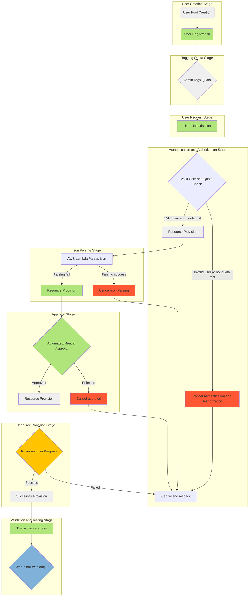

# exhilarating-auto-provision
This repo can be use to provision cloud service by a json template

### Goal of this project
- Proivision the cloud resources  under authentication, authorization, accouting, assign approval when provision, managing the created resources in automtion, scalable and predictable.

> It is possible to implement saga pattern / parallel in this solution.

### The reason of choosing the full-stack web application on AWS serverless architecture because serverless computing offers several benefits:

- Lambda scales automatically based on incoming requests or events.
- Event sources trigger Lambda functions automatically.
- No manual load balancer configuration is needed for Lambda.
- Amazon API Gateway provides load balancing for serverless APIs.

1. Cost Efficiency:
   - With serverless computing, I only pay for the actual compute resources I use, saving me costs compared to traditional server-based architectures.
   - AWS Lambda, the serverless compute service, offers a generous free tier and scales automatically based on my application's demand, minimizing any over-provisioning costs.

2. Scalability:
   - My serverless applications effortlessly handle varying workloads. AWS Lambda scales automatically in response to incoming traffic, ensuring my application remains responsive even under high loads.
   - I can easily accommodate traffic spikes without the need for manual intervention.

3. Simplified Operations and less overhead:
   - Serverless eliminates the need for server provisioning, patching, and maintenance, reducing operational overhead.
   - AWS takes care of managing the underlying infrastructure, including server provisioning, patching, and monitoring, allowing me to focus solely on my application code.

4. Agility and Speed:
   - Serverless enables me to develop and deploy rapidly. I can iterate quickly, deploying updates without any downtime.
   - Breaking down my application into smaller, more manageable functions makes it easier for me to develop and maintain.

5. High Availability:
   - AWS Lambda functions are distributed across multiple availability zones, ensuring high availability by default.
   - AWS services like Amazon API Gateway, Amazon S3, and AWS DynamoDB are regionally distributed for redundancy and fault tolerance.

6. Security:
   - AWS offers a robust security model. I can configure Lambda functions to run within a VPC (Virtual Private Cloud) for network isolation.
   - AWS Identity and Access Management (IAM) provides me with fine-grained control over who can invoke functions and access other AWS resources.

7. Reduced Infrastructure Complexity:
   - With serverless, I no longer need to manage databases or server instances. Services like Amazon Aurora Serverless and Amazon RDS Proxy handle database scaling.
   - AWS services like Amazon S3, DynamoDB, and AWS Cognito can be seamlessly integrated into my serverless application.

8. Auto Scaling and auto load balance:
   - Serverless services automatically scale based on demand, ensuring optimal performance and resource utilization.
   - I don't have to worry about configuring or managing auto-scaling groups manually.

9. Global Reach:
   - AWS has data centers in multiple regions worldwide, allowing me to deploy my serverless application globally for low-latency access by users around the world.

10. Serverless Ecosystem:
    - AWS provides a wide range of serverless services, including AWS Lambda, Amazon API Gateway, AWS Step Functions, AWS App Runner, and more, all of which I can seamlessly integrate into my application architecture.

11. Cost Monitoring and Optimization:
    - AWS offers detailed billing and cost management tools that help me monitor and optimize the costs of my serverless application.

12. Integration with DevOps Practices:
    - Serverless can be seamlessly integrated with DevOps practices like continuous integration and continuous deployment (CI/CD) pipelines, enabling automated testing and deployment in my development process.


### Prerequisite for running this project

1. python3 3.11
2. AWS account using ap-southeast-1 region

### Architecture

- This is Lambda orchestration. Orchestration will be handled by AWS Step Functions, and services handling requests will be handled by AWS Serverless Computing or AWS Fargate running on Amazon ECS


##### Source technology stack
- On premises wordpress application running on Windows Server 2019

##### Target technology stack
- AWS Cognito
- AWS API Gateway 
- AWS Lambda
- AWS Step Function 
> serverless orchestration service that helps you combine AWS Lambda functions and other AWS services to build business-critical applications.
- AWS Secrets Manager
- Amazon Event Bridge
- AWS Identity and Access Management (IAM)
> securely manage access to  AWS resources by controlling who is authenticated and authorized to use them

- Amazon Systems Manager Automation Runbook (only if you wish to manage the ec2 instances directly)
>  manage  applications and infrastructure running in the AWS Cloud. It simplifies application and resource management, shortens the time to detect and resolve operational problems, and helps you manage  AWS resources securely at scale.

- AWS CloudFormation 
>  Set up AWS resources, provision them quickly and consistently, and manage them throughout their lifecycle across AWS accounts and Regions.
- AWS EC2 instances
- Network Configurations (VPC, subnmets, internet gateway, jump server, security groups)


### The flow of use case

0. [User creation stage] User pool creation done by admin 
1. [User registration stage] User registeration with AWS cognito 
2. [Tagging quota stage] Admin can tag the custom attribute, such as `ntu-scse-2023-ct1' have 20000 quota` map into the user in AWS cognito
```json
    {
        'Key': 'BusinessUnit',
        'Value': 'ntu-scse-2023-ct1'
    },
    {
        'Key': 'Quota',
        'Value': '20000'
    }
```
3. [User request stage] The user then upload the json template by REST API call.
    - The specifcation of json file
        1. Name of the application 
        > will be used in part of the domain name registration in AWS route 53
        2. The target environment: Development(dev) , staging (stag), Production (prod) 
        > By stating different target environment, different toplogy will be used thus make it cost effective
        3.The target project type: Static /Dynamic / SPA / CMS 
        4. if not static, the techstack is required: PHP, Ruby on Rails/ Node.js/ MEAN / Wordpress/ Strapi
        5. Project URL: github.com/xxxx
        6. Project access token: xxxx
        7. Project private key: xxxx
        8. Project email: xxx@xxx
4. [Authentication and authorization stage] If the user is valid user and have sufficient quota, the resource will be provision. 2FA can be added.
5. [json parsing stage] The json template then parse by the AWS Lambda, and matching the predefined parameters to pass into predefined AWS Cloudformation template. This steps is scalable as we can add more predefined template for different web application:
    - Static Websites 
        - AWS resource: CDN/Cloudfront with S3
        - Tech stack: HTML, CSS, Javascript site generators like Jekyll or Hugo
    - Dynamic webiste:
        - Often using server side scripting
        - Tech stack: PHP , Ruby on Rails, Node.js with backend: Django/ Flask/ FastAPI)
    - Single Page application (SPAs):
        - Deployment: Hosted on web servers or CDNs
        - Tech Stack: React, Angular, Vue3 with RESTful or GraphQL APIs
    - Content Management Systemt (CMS):
        - Deployment: Hosted on web servers or CDNs
        - Tech Stack: Wordpress, Ghost, Drupal, and Strapi
    - Real time web application:
        - Deployment: With WebSocket support, chatbot usecase or video streaming
        - Tech Stack: WebRTC, SocketIO, NodeJS for real time updates.
    - Dapp
    - Etc...
6. [Approval stage] The apporval workflow is embeded, where automated/manual approval can be obtained before the resource provision 
7. [Resource Provision stage] While the provision takes time, the event driven architecture allow provision stage loose coupling from the user request
8. [Provision successful stage] The successful event yield the output of the web application url. The URL will then be send to the user email. User can obtain the url for further processing such as perform dynamic application security testing
9. [Validation and testing stage] The logs of this application including the provision web application will be aggregated and collected into AWS cloudwatch system where the devops team can monitor and troubleshoot if anything goes wrong. Security team can use the logs into SIEM system such as Splunk Cloud or Cribl LogStream. 


### Flow chart




# Reference

1. https://www.ecsworkshop.com/monitoring/container_insights/
2. https://aws.github.io/copilot-cli/docs/overview/
3. https://github.com/aws-containers/ecsdemo-frontend
4. https://github.com/aws-containers/ecsdemo-nodejs
5. https://github.com/kevanpeters/cdk_tutorial_python
6. [AWS Copilot adds support for full customization with AWS CDK or YAML overrides](https://aws.amazon.com/about-aws/whats-new/2023/03/aws-copilot-customization-cdk-yaml-overrides/)
7. https://dev.to/aws-builders/stack-creation-through-step-function-workflow-execution-3p7h
8. [SSM reference](https://docs.aws.amazon.com/systems-manager/latest/userguide/automation-actions.html)
9. [automation-runbook-reference](https://docs.aws.amazon.com/systems-manager-automation-runbooks/latest/userguide/automation-runbook-reference.html)
10. [This pattern implements an automation document wrapper around AWS-RunShellScript execution for a AWS Step Functions waitForTaskToken integration.](https://github.com/aws-samples/amazon-stepfunctions-ssm-waitfortasktoken)
11. [Run AWS Systems Manager automation tasks synchronously from AWS Step Functions](https://docs.aws.amazon.com/prescriptive-guidance/latest/patterns/run-aws-systems-manager-automation-tasks-synchronously-from-aws-step-functions.html)
12. [Use the power of script steps in  Systems Manager Automation runbooks](https://aws.amazon.com/blogs/mt/use-script-steps-in--systems-manager-automation-runbooks/)
13. [AWS CloudFormation stack updates](https://docs.aws.amazon.com/AWSCloudFormation/latest/UserGuide/using-cfn-updating-stacks.html)
14. [Custom Domain Names](https://aws.github.io/chalice/tutorials/customdomain.html)
15. [Chalice supports multiple mechanisms for authorization.](https://aws.github.io/chalice/topics/authorizers.html)
16. [Building a static website with Hugo and the CDK](https://www.tecracer.com/blog/2020/05/building-a-static-website-with-hugo-and-the-cdk.html)
17. [Create cost optimzed ecs cluster with cloudformation template](https://templates.cloudonaut.io/en/stable/ecs/#ecs-cluster-cost-optimzed)
18. [Create Lambda Functions in a VPC in AWS CDK](https://bobbyhadz.com/blog/aws-cdk-lambda-function-vpc)
19. [ConsoleMe is a multi-account AWS Swiss Army knife](https://hawkins.gitbook.io/consoleme/)
20. [copilot cli](https://aws.github.io/copilot-cli/docs/overview/)
21. [Saga pattern with copilot](https://copilot.rocks/implementing-architectural-patterns/20-implementing-saga-pattern/)
21. [Using AWS Lambda Layers with AWS Chalice](https://aws.amazon.com/blogs/developer/using-aws-lambda-layers-with-aws-chalice/)
22. [Best Practices for Running Container WordPress on AWS (ECS, EFS, RDS, ELB) using CDK](https://dev.to/aws-builders/best-practices-for-running-wordpress-on-aws-using-cdk-aj9)
23. [Stack Creation through Step Function Workflow Execution](https://dev.to/aws-builders/stack-creation-through-step-function-workflow-execution-3p7h)
24. [Step function Call other AWS services](https://docs.aws.amazon.com/step-functions/latest/dg/connect-to-services.html)
25. [Step function Manage an Amazon EKS cluster](https://docs.aws.amazon.com/step-functions/latest/dg/sample-eks-cluster.html)
26. [step function workshop by aws](https://catalog.workshops.aws/stepfunctions/en-US)
27. [AWS Step Functions and AWS Serverless Application Model - Built on AWS CloudFormation](https://docs.aws.amazon.com/step-functions/latest/dg/concepts-sam-sfn.html)
28. [AWS Serverless Application Model - Build serverless applications in simple and clean syntax](https://aws.amazon.com/serverless/sam/)
29. [[Handbook] AWS Step Functions Input and Output Manipulation](https://blog.devgenius.io/handbook-aws-step-functions-input-and-output-manipulation-f94d57087e41)
30. [Running aws-cli Commands Inside An AWS Lambda Function](https://alestic.com/2016/11/aws-lambda-awscli/)
31. [Building custom runtimes in AWS SAM](https://docs.aws.amazon.com/serverless-application-model/latest/developerguide/building-custom-runtimes.html)
32. [Start a Workflow within a Workflow (Step Functions, Lambda)](https://docs.aws.amazon.com/step-functions/latest/dg/sample-start-workflow.html)


### 2 possible way 
1. [step function](https://docs.aws.amazon.com/step-functions/latest/dg/cw-events.html) -> event bridge -> system manager ([can listen changes from event bridge](https://docs.aws.amazon.com/systems-manager/latest/userguide/running-automations-event-bridge.html)) -> [cloud formation](https://docs.aws.amazon.com/systems-manager/latest/userguide/application-manager-working-stacks-overview.html)

2. Step function directly invoke [the supported resource](https://docs.aws.amazon.com/step-functions/latest/dg/supported-services-awssdk.html#supported-services-awssdk-list) -> 

```
arn:aws:states:::aws-sdk:cloudformation:[apiAction]	

createStack: Used to create a new CloudFormation stack.
updateStack: Used to update an existing CloudFormation stack.
deleteStack: Used to delete a CloudFormation stack.
describeStacks: Used to retrieve information about one or more CloudFormation stacks.
listStacks: Used to list CloudFormation stacks in the AWS account.
createChangeSet: Used to create a change set for a CloudFormation stack.
executeChangeSet: Used to execute a change set for a CloudFormation stack.

arn:aws:states:::aws-sdk:cloudformation:createStack

```

### Pending to be completed

- Due to the time limit, only the core module of creation stack with standard step function flow is created.
- The functions to be completed:
    - The Authorization of users with AWS Cognito
    - Attached VPC creation for step function and target web application
    - The S3 bucket integration with trigger the step function for user to upload their template.
    - Step function:
        - The SNS service for sending email once provision completed
        - The describing AWS cloud stack provision service function
        - The SQS service for Approval Workflow
        - Managing the cloud formation stack lifecycle
    
    
